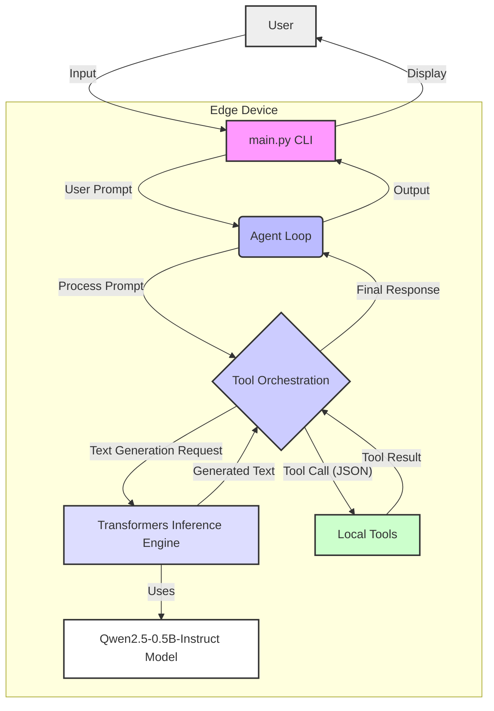

# 📐 EdgeAgent Architecture Diagram

## Components Overview:

1.  **User**: Interacts with the EdgeAgent via a Command Line Interface (CLI).
2.  **`main.py` (CLI Entry Point)**: Initializes the `EdgeAgent` and handles user input/output for the CLI.
3.  **Agent Loop (`agent.py`)**: The core brain of the EdgeAgent. It maintains conversation history, processes user prompts, decides whether to generate text directly or call a tool, and orchestrates the flow.
4.  **Tool Orchestration (`agent.py`)**: Part of the Agent Loop responsible for parsing the model's response for tool call instructions, executing the appropriate local tool, and integrating the tool's output back into the conversation context.
5.  **Transformers Inference Engine (`inference.py`)**: Loads the Qwen2.5-0.5B-Instruct model and handles text generation. It communicates with the underlying Hugging Face `transformers` library to run the LLM locally on the CPU.
6.  **Qwen2.5-0.5B-Instruct Model**: The pre-trained Large Language Model (LLM) downloaded from Hugging Face, stored locally. This model is chosen for its small size, making it suitable for on-device deployment.
7.  **Local Tools (`tools/__init__.py`)**: A collection of Python functions that allow the EdgeAgent to interact with the local environment. Examples include `read_file`, `write_file`, `list_files`, `run_command`, and `get_system_info`.

## Flow of Interaction:

1.  **User Input**: The user provides a prompt via the CLI (`main.py`).
2.  **Agent Processing**: The prompt is sent to the `Agent Loop`.
3.  **Decision Making**: The `Agent Loop` (specifically, `Tool Orchestration`) analyzes the prompt and the current conversation history to decide:
    *   If a tool is needed, it forms a tool call (JSON format).
    *   If no tool is needed, it requests text generation from the `Transformers Inference Engine`.
4.  **Tool Execution**: If a tool call is made, the `Local Tools` module executes the specified function (e.g., `get_system_info`). The result is returned to the `Tool Orchestration`.
5.  **Text Generation**: The `Transformers Inference Engine` generates a response, either directly to the user's prompt or by considering the results of executed tools. It uses the `Qwen2.5-0.5B-Instruct Model`.
6.  **Output**: The final response from the agent is displayed back to the user via the CLI.